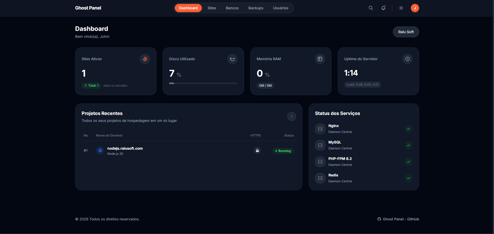

<div align="center">

# GhostPanel

**Painel de gerenciamento de servidores self-hosted — instalável com um único comando.**

Gerencie PHP, Node.js, Python, WordPress, MySQL, SSL, Firewall e Backups direto do browser, sem depender de serviços terceiros.

[](LICENSE)
[](https://php.net)
[](https://laravel.com)
[](https://nodejs.org)

</div>

<p align="center">
  
</p>

---

## Por que criei isso?

Estava cansado de painéis que nunca faziam exatamente o que eu precisava e limitados, cheio de serviços pagos ou sem liberdade pra melhorar — resolvi criar o meu do jeito que eu queria.

O GhostPanel era mais pessoal, mas vi que muita gente deve ter o mesmo problema. Então decidi deixar aberto pra quem quiser usar, modificar facilmente.

> **Nota:** O desenvolvimento desse projeto contou com ajuda de IA. O código foi escrito e revisado por mim, mas com assistência de IA. Se você quiser baixar, usar, modificar ou fazer o que quiser com ele — fique à vontade. É exatamente pra isso que está aqui.

---

## Funcionalidades

### Sites e Aplicações
- **PHP** — Vhost Nginx + PHP-FPM por site com pool dedicado
- **Node.js** — Supervisor (processo persistente) + proxy reverso Nginx
- **Python** — venv isolado + Gunicorn + proxy Nginx
- **WordPress** — Instalação automática via WP-CLI + regras Nginx otimizadas
- **SSL automático** — Let's Encrypt via Certbot com renovação automática

### Banco de Dados
- Criação e gerenciamento de bancos MySQL por site
- Integração com phpMyAdmin
- Limites por usuário configuráveis

### Segurança
- **HTTP Basic Auth** por site com senha segura (APR1-MD5)
- **Whitelist de IP** por site via Nginx `allow/deny`
- **Hardening PHP** — `disable_functions`, `open_basedir`, `allow_url_fopen=Off`
- **Prevenção de Web Shells** — bloqueia execução de PHP em pastas de upload
- Todo comando do sistema passa por whitelist + `escapeshellarg()` + log de auditoria

### Terminal e Logs
- Terminal web interativo (WebSocket + node-pty) — executa como `www-data` restrito à pasta do site
- Logs em tempo real com streaming via WebSocket
- Visualização de access.log, error.log e logs da aplicação

### Backups
- Backup por site (tar.gz) com auto-expiração em 3 dias
- Download direto pelo browser
- Agendado via Laravel Scheduler

### Multi-Usuário
- **Admins** — acesso total ao painel
- **Usuários comuns** — acesso apenas aos sites atribuídos, limite de bancos por site
- Gestão completa via interface: criar, editar, ativar/desativar usuários

### Firewall
- Gerenciamento de regras UFW pelo browser
- Adicionar/remover portas por TCP/UDP

---

## Instalação

### Requisitos

| Item | Mínimo |
|---|---|
| OS | Ubuntu 22.04 / 24.04 ou Debian 11 / 12 |
| RAM | 1 GB |
| Disco | 10 GB livres |
| Acesso | Root (`sudo`) |

### Comando de instalação

```bash
curl -fsSL https://raw.githubusercontent.com/syncroto/GhostPanel/refs/heads/main/install.sh | sudo bash
```

**Com opções:**

```bash
# Porta personalizada
curl -fsSL https://raw.githubusercontent.com/syncroto/GhostPanel/refs/heads/main/install.sh | sudo bash -s -- --port 8443

# Sem prompts interativos (instala stack padrão)
curl -fsSL https://raw.githubusercontent.com/syncroto/GhostPanel/refs/heads/main/install.sh | sudo bash -s -- --no-interactive
```

### O que o instalador faz

```
1. Verifica root, OS compatível, RAM e disco
2. Pergunta quais componentes instalar:
   ├── Nginx
   ├── PHP 8.2 + extensões + Composer
   ├── MySQL 8
   ├── PostgreSQL
   ├── Redis
   ├── Node.js 20 (via NVM)
   ├── Python 3 + venv
   ├── FTP (vsftpd)
   └── Backup automático
3. Instala e configura cada stack selecionada
4. Clona o repositório GPanel
5. Roda composer install + npm build
6. Gera .env, roda migrations (SQLite)
7. Configura Nginx para servir o painel na porta 8442
8. Configura Supervisor (queue workers + node helper)
9. Configura UFW (firewall)
10. Registra o comando gpanel globalmente
```

### Primeiro acesso

Após a instalação, acesse no browser:

```
http://SEU_IP:8442
```

O wizard de setup será exibido **uma única vez** para criar o primeiro administrador.

### Hardening PHP (recomendado)

```bash
sudo bash /gpanel/scripts/harden-php.sh
```

Aplica `disable_functions`, `open_basedir` por site, e bloqueia execução de PHP em pastas de upload via Nginx.

---

## Arquitetura

```
/gpanel/
├── panel/          # Laravel 11 — painel web, API, auth, jobs
├── node-helper/    # Node.js — WebSocket (terminal + logs em tempo real)
├── scripts/        # Scripts bash e templates Nginx
│   └── templates/  # nginx-php.conf, nginx-node.conf, nginx-python.conf
├── agent/          # PHP CLI daemon (reservado)
└── storage/        # Logs, backups, database.sqlite
```

### Stack técnica

| Componente | Tecnologia | Papel |
|---|---|---|
| Painel web | PHP 8.2 + Laravel 11 | Interface, API interna, auth, jobs |
| Frontend | Blade + Alpine.js + Tailwind | Server-rendered, dark mode |
| Banco do painel | SQLite | Zero dependência circular |
| Real-time | Node.js + `node-pty` + `ws` | Terminal interativo e streaming de logs |
| Workers | Laravel Queue + Supervisor | Jobs longos: criar site, backup, SSL |
| Automação | Bash scripts | install.sh, templates Nginx, provisionamento |

---

## Fluxo de segurança

Todo comando executado no sistema passa obrigatoriamente pelo `CommandService`:

```
Usuário clica em ação
        ↓
Laravel valida permissão do usuário autenticado
        ↓
CommandService verifica operação na whitelist
        ↓
Parâmetros sanitizados com escapeshellarg()
        ↓
Log de auditoria gravado (usuário + IP + timestamp)
        ↓
proc_open() executa com timeout máximo
        ↓
Resultado retornado ao frontend
```

> **Regra crítica:** `shell_exec($input_do_usuario)` **nunca** é usado. Todo input de usuário é tratado como não confiável.

---

## CLI — Comando `gpanel`

O comando `gpanel` é registrado em `/usr/local/bin/gpanel` durante a instalação.

### Usuários Admin

```bash
gpanel admin:create           # Criar novo admin (interativo)
gpanel admin:list             # Listar todos os admins
gpanel admin:reset-password   # Resetar senha de um admin
```

### Painel

```bash
gpanel panel:status           # Status de todos os serviços
gpanel panel:restart          # Reiniciar workers e node helper
gpanel panel:update           # Atualizar para a última versão (git pull + build)
gpanel panel:update --frontend  # Atualizar apenas os assets visuais (npm build)
gpanel panel:update --backend   # Atualizar apenas o backend (git pull + composer)
gpanel panel:uninstall        # Desinstalar o GPanel (mantém sites e serviços)
```

### Utilitários

```bash
gpanel queue:work             # Iniciar worker manualmente
gpanel migrate                # Rodar migrations
gpanel tinker                 # REPL interativo
gpanel logs                   # Ver logs (via pail)
```

---

## Gerenciamento de Sites

| Tipo | O que é configurado automaticamente |
|---|---|
| **PHP** | Vhost Nginx + PHP-FPM |
| **Node.js** | Supervisor (processo persistente) + proxy reverso Nginx |
| **Python** | venv isolado + Gunicorn + proxy Nginx |
| **WordPress** | PHP-FPM + download via WP-CLI + regras Nginx específicas |

---

## Desenvolvimento local

```bash
# Clone o repositório
git clone https://github.com/syncroto/GhostPanel.git
cd GhostPanel/panel

# Instala dependências PHP
composer install

# Configura ambiente
cp .env.example .env
php artisan key:generate

# Cria o banco SQLite e roda migrations
touch database/database.sqlite
php artisan migrate

# Instala dependências JS e compila assets
npm install && npm run build

# Sobe o servidor de desenvolvimento
php artisan serve --port=8442
```

Para o Node.js helper em dev:

```bash
cd node-helper
npm install
npm run dev
```

---

## Variáveis de ambiente principais

| Variável | Padrão | Descrição |
|---|---|---|
| `APP_KEY` | *(gerado)* | Chave de criptografia do Laravel |
| `APP_URL` | `http://localhost:8442` | URL do painel |
| `DB_DATABASE` | `/gpanel/storage/database.sqlite` | Caminho do banco SQLite |
| `QUEUE_CONNECTION` | `database` | Driver de filas |
| `GPANEL_PORT` | `8442` | Porta do painel |
| `GPANEL_DIR` | `/gpanel` | Diretório de instalação |
| `GPANEL_WS_PORT` | `3001` | Porta do WebSocket helper |

---

## Roadmap

| Fase | Status | Entregas |
|---|---|---|
| **Fase 1 — MVP** | ✅ Concluído | `install.sh` → wizard `/setup` → dashboard → criar site PHP → CLI `gpanel` |
| **Fase 2 — Stacks** | ✅ Concluído | Node.js → Python → WordPress → banco de dados → phpMyAdmin |
| **Fase 3 — Segurança** | ✅ Concluído | Firewall UFW → Basic Auth → whitelist IP → hardening PHP → prevenção web shells |
| **Fase 4 — Real-time** | ✅ Concluído | Terminal web (WebSocket) → logs em tempo real → backups por site |
| **Fase 5 — Multi-usuário** | ✅ Concluído | Gestão de usuários → roles admin/user → controle de acesso por site → limite de DBs |
| **Fase 6 — Polimento** | 🔄 Em andamento | 2FA → notificações → métricas de uso → API pública |

---

## Licença

MIT — use, modifique, distribua. Sem restrições.
